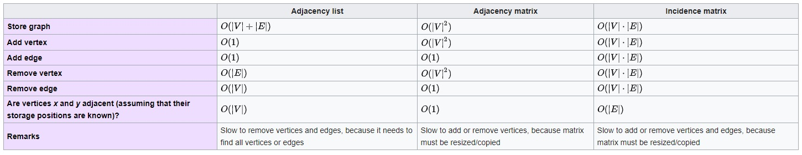

# 01 Simple Graph

## Logic
Graphs in very simple term are dots connected to lines with each dot and line having a relevance. As an ADT they are special kind of trees that can have loops and are represented in terms of Edges (lines) and Vertices (dots). Two vertices A and B are connected by edge E{A, B}. This connection can be directed or undirected. Edges can have weight indicating cost between two vertices. 

Scope of this session is simple graphs. So we will refrain from getting into any special kind of graph, but will note them down for reference. 

* Simple Graphs
    * Undirected or directed graphs
    * Weighted graphs
* Cyclic or acyclic graphs
    * Directed acyclic graphs
* Disconnected graphs
* Multigraph - with parallel edges
* Pseudograph - with parallel edges and self loops

sum(deg(all v)) = 2E
sum(indeg(v)) / sum(outdeg(v)) = E
Emax = v(v-1) / 2  |  undirected graph

If E = v-1, graph is a tree.
**Spanning Tree** - subgraph of a graph without loops
**Forest** - graph without cycles
**Complete graphs** - All nodes are reachable through connections
**Strongly Connected graphs** - All nodes are reachable (bidirectional)

Image credit : [Wikipedia](https://en.wikipedia.org/wiki/Graph_(abstract_data_type))

Degree - # edges connected to a vertex.
In Degree - # incoming edges
Out Degree - # outgoing edges

## Implementation

**Graphs can be implemented as** 
 1. Adjacency Matrix - use when graph is dense
 2. Adjacency List - use when graph is sparse
 3. Adjacency Set
 4. Incidence Matrix

 **Search alogrithms**
  1. BFS - Visit all adjacent nodes first and then for each adjacent node visit its adjacents recursively. (Queue)
  2. DFS - Traverse list to deepest node in chain then track back and visit adjacenct's deepest node recursively. (Stack)

  BFS or DFS? Depends on problem statement. Close to top BFS, close to bottom DFS.

**Basic operations on graphs we'll look into**
 1. areAdjacent(G, x, y) - Is there an edge between x, y
 2. neightbors(G, x, n) - nth degree (level) adjacent vertices to x
 3. addVertex(G, x) - adds vertex x to graph if its not present
 4. removeVertex(G, x) - removes vertex x from graph if it is present
 5. addEdge(G, x, y, d) - add edge to graph from x to y. 
 d indicates if it is undirected, directed or bi-directional.
 6. reomveEdge(G, x, y) - removes edge from x to y
 7. getVertexValue(G, x) - returns value associated with vertex x
 8. setVertexValue(G, x) - sets value associated with vertex x
 9. getEdgeValue(G, x, y) - get weight of E(x,y)
10. setEdgeValue(G, x, y) - set weight of E(x,y)

## Usages 

## Good Problems
1. Shortest (cheapest) distance from S to D.
    * Using BFS
    * Using Dijkstra's Algorithm
    * Bellman Ford's Algorithm
    * Prim's Algorithm
    * Kruskal's Algorithm

## Comments

